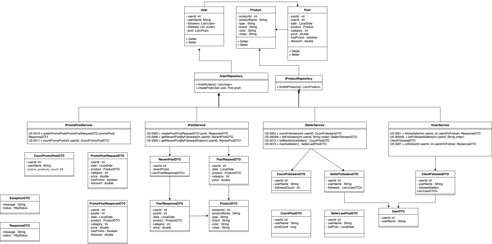
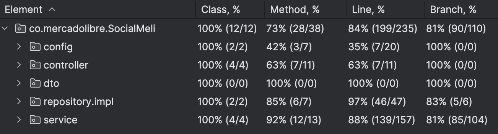

# Social Meli

Enlace repositorio de equipo: https://github.com/SebastianValleRang/be_java_hisp_w27_g03

---


## Integrantes

- Ana Maria García Acosta
- Angela Tatiana Daza Rojas
- Leandro Jossue Ramirez Vezga
- Sebastian Vallejo Rangel
- Vanessa Lozano Landinez

## Descripción del Proyecto

Social Meli es una aplicación desarrollada con Spring Boot que permite gestionar las relaciones entre usuarios y vendedores, sus publicaciones y productos en promoción.

## Tecnologías Utilizadas

- **SDK:** 22
- **Java:** 21
- **Spring Boot:** 3.3.4

### Dependencias

- **Spring Dev Tools**
- **Spring Web**
- **Lombok**

---

## Estructura del Proyecto

El proyecto está compuesto por las siguientes entidades:

- **User**
- **Post**
- **Product**

### Controladores y Servicios

Se implementan cuatro controladores, cada uno con sus respectivos servicios:

- **Post Controller**
- **Promo Controller**
- **Seller Controller**
- **User Controller**

A continuación, se presenta un diagrama que ilustra la estructura del proyecto, incluyendo los DTOs, repositorios e interfaces utilizadas:

<p align="center"></p>

---

## Cómo Ejecutar el Proyecto

Para probar ejecutar y hacer uso del proyecto se cuenta con una collección de Postman con los request necesarios para verificar cada user story.
Este archivo se encuentra en:
```src/main/resources/Sprint II.postman_collection.json ```


---

## Endpoints y responsables

- **US 0001:** Poder realizar la acción de “Follow” (seguir) a un determinado vendedor.
  - **Endpoint:** /users/{userId}/follow/{userIdToFollow}
  - **Responsable:** Angela Daza.
  - **Reglas de verificación:** 
    1. El usuario con id userId debe existir
    2. El usuario con id userIdToFollow debe existir y ser vendedor (tener al menos 1 post)
    3. El usuario no se puede seguir a si mismo
    4. Se verifica si el usuario ya es seguidor del vendedor


- **US 0002:** Obtener el resultado de la cantidad de usuarios que siguen a un determinado vendedor
  - **Endpoint:** /users/{userId}/followers/count
  - **Responsable:** Vanessa Lozano.
  - **Reglas de verificación:** El usuario con id userId debe existir y ser vendedor (tener al menos 1 post)


- **US 0003:** Obtener un listado de todos los usuarios que siguen a un determinado vendedor
  - **Endpoint:** /users/{userId}/followers/list
  - **Responsable:** Vanessa Lozano.
  - **Reglas de verificación:** El usuario con id userId debe existir y ser vendedor (tener al menos 1 post)


- **US 0004:** Obtener un listado de todos los vendedores a los cuales sigue un determinado usuario (¿A quién sigo?)
  - **Endpoint:** /users/{userId}/followed/list
  - **Responsable:** Ana Garcia.
  - **Reglas de verificación:** El usuario con id userId debe existir


- **US 0005:** Dar de alta una nueva publicación
  - **Endpoint:** /products/post
  - **Responsable:** Leandro Ramírez.
  - **Reglas de verificación:**
    1. Se verifica que los datos enviados en la request estén completos y en el formato indicado
    1. El usuario con el id enviado para crear el post debe existir
    1. El producto enviado para crear el post debe existir en el repositorio de productos y coincidir en sus datos


- **US 0006:** Obtener un listado de las publicaciones realizadas por los vendedores que un usuario sigue en las últimas dos semanas (para esto tener en cuenta ordenamiento por fecha, publicaciones más recientes primero).
  - **Endpoint:** /products/followed/{userId}/list
  - **Responsables:** Leandro Ramírez y Sebastian Vallejo.
  - **Reglas de verificación:**
    1. El usuario con id userId debe existir
    1. El usuario con id userId debe seguir a al menos 1 vendedor


- **US 0007:** Poder realizar la acción de “Unfollow” (dejar de seguir) a un determinado vendedor.
  - **Endpoint:** /users/{userId}/unfollow/{userIdToUnfollow}
  - **Responsable:** Angela Daza.
  - **Reglas de verificación:**
    1. El usuario con id userId debe existir
    2. El usuario con id userIdToUnfollow debe existir y ser vendedor (tener al menos 1 post)
    3. Se verifica que el usuario con userId sea actualmente seguidor del vendedor 


- **US 0008:** Ordenamiento alfabético ascendente y descendente.
  - **Endpoint:** 
    - /users/{UserID}/followed/list?order=name_asc
    - /users/{UserID}/followed/list?order=name_desc
  - **Responsable:** Ana Garcia.
  - **Endpoint:** 
    - /users/{UserID}/followers/list?order=name_asc
    - /users/{UserID}/followers/list?order=name_desc
  - **Responsable:** Vanessa Lozano.
  - **Reglas de verificación:** Se verifica que el parámetro enviado (order) sea un ordenamiento válido (name_asc o name_desc)


- **US 0009:** Ordenamiento por fecha ascendente y descendente
  - **Endpoint:** 
  - /products/followed/{userId}/list?order=date_asc
  - /products/followed/{userId}/list?order=date_desc
  - **Responsable:** Leandro Ramírez.
  - **Reglas de verificación:** Se verifica que el parámetro enviado (order) sea un ordenamiento válido (date_asc o date_desc)


- **US 0010:** Llevar a cabo la publicación de un nuevo producto en promoción.
  - **Endpoint:** /products/promo-post
  - **Responsable:** Sebastian Vallejo.
  - **Reglas de verificación:**
    1. Se verifica que los datos enviados en la request estén completos y en el formato indicado
    1. El usuario con el id enviado para crear el post debe existir
    1. El producto enviado para crear el post debe existir en el repositorio de productos y coincidir en sus datos


- **US 0011:** Obtener la cantidad de productos en promoción de un determinado vendedor.
  - **Endpoint:** /products/promo-post/count?user_id={userId}
  - **Responsable:** Sebastian Vallejo.
  - **Reglas de verificación:** El usuario con id userId debe existir y ser vendedor (tener al menos 1 post)


### Bonus:

- **US 0012:** Listar los 5 vendedores con más posts
  - **Endpoint:** /users/list/most_active_sellers
  - **Responsables:** Leandro Ramírez y Sebastian Vallejo.
  - **Reglas de verificación:** Se verifica que el repositorio cuente con usuarios y al menos uno de ellos sea vendedor (tenga al menos 1 post)
    

- **US 0013:** Listar los vendedores inactivos, es decir que no han hecho publicaciones en los últimos 6 meses
  - **Endpoint:** /users/list/inactive_sellers
  - **Responsables:** Ana Garcia, Angela Daza y Vanessa Lozano
  - **Reglas de verificación:** 
    1. Se considera como vendedor inactivo a aquellos vendedores que no han publicado en los últimos 6 meses. 
    2. Se valida que existan usuarios en el repositorio
    3. Se valida si no existen vendedores inactivos

---

## Tests 

Para cumplir los estándares de calidad de Mercado Libre implementamos diferentes validación según lo requerido, así como test unitarios y de integración. Esto con el objetivo de alcanzar una cobertura de código testeado mayor al 80%.

<p align="center"></p>

### Test unitarios requeridos:
- **T 0001:** Verificar que el usuario a seguir exista
  - **User story:** US0001
  - **Responsable:** Leandro Diaz
  - **Comportamiento esperado:** Se cumple: Permite continuar con normalidad. No se cumple: Notifica la no existencia mediante una excepción.

- **T 0002:** Verificar que el usuario a dejar de seguir exista.
  - **User story:** US0007
  - **Responsable:** Leandro Diaz
  - **Comportamiento esperado:** Se cumple: Permite continuar con normalidad. No se cumple: Notifica la no existencia mediante una excepción.

- **T 0003:** Verificar que el tipo de ordenamiento alfabético exista
  - **User story:** US0008
  - **Responsable:** Sebastian Vallejo
  - **Comportamiento esperado:** Se cumple: Permite continuar con normalidad. No se cumple: Notifica la no existencia mediante una excepción.

- **T 0004:** Verificar el correcto ordenamiento ascendente
  y descendente por nombre
  - **User story:** US0008
  - **Responsable:** Ana Garcia
  - **Comportamiento esperado:** Devuelve la lista ordenada según el criterio solicitado
  
- **T 0005:** Verificar que el tipo de ordenamiento por fecha exista
  - **User story:** US0009
  - **Responsable:** Angela Daza
  - **Comportamiento esperado:** Se cumple: Permite continuar con normalidad. No se cumple: Notifica la no existencia mediante una excepción.

- **T 0006:** Verificar el correcto ordenamiento ascendente y descendente por fecha.
  - **User story:** US0009
  - **Responsable:** Angela Daza
  - **Comportamiento esperado:** Verificar el correcto ordenamiento ascendente y descendente por fecha.

- **T 0007:** Verificar que la cantidad de seguidores de un determinado usuario sea correcta
  - **User story:** US0002
  - **Responsable:** Ana Garcia
  - **Comportamiento esperado:** Devuelve el cálculo correcto del total de la cantidad de seguidores que posee un usuario.
  
- **T 0008:** Verificar que la consulta de publicaciones realizadas en las últimas dos semanas de un determinado vendedor sean efectivamente de las últimas dos semanas.
  - **User story:** US0006
  - **Responsable:** Vanessa Lozano
  - **Comportamiento esperado:** Devuelve únicamente los datos de las publicaciones que tengan fecha de publicación dentro de las últimas dos semanas a partir del día de la fecha

### Test unitarios extras:
- **T 0001 EXTRA:** Verificar que el usuario que desea seguir exista
  - **User story:** US0001
  - **Responsable:** Leandro Diaz
  - **Comportamiento esperado:** Se cumple: Permite continuar con normalidad. No se cumple: Notifica la no existencia mediante una excepción.

- **T 0001 EXTRA2:** Verificar que el usuario a seguir sea un vendedor (tenga al menos un post)
  - **User story:** US0001
  - **Responsable:** Leandro Diaz
  - **Comportamiento esperado:** Se cumple: Permite continuar con normalidad. No se cumple: Notifica la bad request mediante una excepción.

- **T 0002 EXTRA:** Verificar que el usuario que desea dejar de seguir exista.
  - **User story:** US0007
  - **Responsable:** Leandro Diaz
  - **Comportamiento esperado:** Se cumple: Permite continuar con normalidad. No se cumple: Notifica la no existencia mediante una excepción.

- **T 0002 EXTRA:** Verificar que el usuario que desea dejar de seguir actualmente siga al vendedor.
  - **User story:** US0007
  - **Responsable:** Leandro Diaz
  - **Comportamiento esperado:** Se cumple: Permite continuar con normalidad. No se cumple: Notifica la bad request mediante una excepción.

- **T 0010:** Verifica que existen vendedores para devolver la lista de vendedores más activos
  - **User story:** US0007
  - **Responsable:** Sebastian Vallejo
  - **Comportamiento esperado:** Se cumple: Devuelve la lista de vendedores más activos. No se cumple: Notifica la no existencia mediante una excepción.


### Bonus: Test de integración

- **TI 0001:** Verificar el endpoint /users/{userId}/follow/{userIdToFollow}. Ambos usuarios deben ser válidos.
  - **User story:** US0001
  - **Responsable:** Leandro Diaz
  - **Comportamiento esperado:** Se cumple:Devuelve un ResponseDTO con el mensaje y el HttpStatus 200. No se cumple: Notifica la no existencia mediante un ExceptionDTO con status not found

- **TI 0003:** Verificar que en los endpoints /users/{UserID}/followers/list?order=...  /users/{UserID}/followed/list?order=... el tipo de ordenamiento alfabético exista
  - **User story:** US0008
  - **Responsable:** Sebastian Vallejo
  - **Comportamiento esperado:** Se cumple:Devuelve un ResponseDTO con el mensaje y el HttpStatus 200. No se cumple: Notifica la no existencia mediante un ExceptionDTO con status bad request

- **TI 0005:** Verificar que en el endpoint /products/followed/{userId}/list?order=... el tipo de ordenamiento por fecha exista
  - **User story:** US0009
  - **Responsable:** Angela Daza
  - **Comportamiento esperado:** Se cumple:Devuelve un ResponseDTO con el mensaje y el HttpStatus 200. No se cumple: Notifica la no existencia mediante un ExceptionDTO con status bad request
  
- **TI 0006:** Verificar que en el endpoint /products/followed/{userId}/list?order=...  la lista tiene el correcto ordenamiento ascendente y descendente por fecha.
  - **User story:** US0009
  - **Responsable:** Angela Daza
  - **Comportamiento esperado:** Devuelve la lista ordenada según el criterio solicitado
  
- **TI 0007:** Verificar que el endpoint /users/{userId}/followers/count devuelva correctamente el número de seguidores
  - **User story:** US0002
  - **Responsable:** Ana Garcia
  - **Comportamiento esperado:** Devuelve el cálculo correcto del total de la cantidad de seguidores que posee un usuario.

- **TI 0008:** Verificar que en el endpoint  /products/followed/{userId}/list la consulta de publicaciones realizadas en las últimas dos semanas de un determinado vendedor sean efectivamente de las últimas dos semanas.
  - **User story:** US0006
  - **Responsable:** Vanessa Lozano
  - **Comportamiento esperado:** Devuelve únicamente los datos de las publicaciones que tengan fecha de publicación dentro de las últimas dos semanas a partir del día de la fecha.

- **TI 0009:** Verificar que el endpoint /products/promo-post/count devuelva correctamente el número de post en promoción
  - **User story:** US0011
  - **Responsable:** Vanessa Lozano
  - **Comportamiento esperado:** Devuelve el cálculo correcto del total de la cantidad de post en promoción que posee un vendedor

- **TI 0010:** Verificar que el endpoint /list/most_active_sellers devuelva correctamente la lista de vendedores con más posts
  - **User story:** US0012
  - **Responsable:** Ana Garcia
  - **Comportamiento esperado:** Devuelve la lista de  los vendedores con más posts

- **TI 0011:** Verificar que el endpoint /users/list/inactive_sellers devuelva correctamente la lista de vendedores inactivos
  - **User story:** US0013
  - **Responsable:** Sebastian Vallejo
  - **Comportamiento esperado:** Devuelve la lista de los vendedores inactivos (no han hecho publicaciones en los últimos 6 meses)

---


## Futuras implementaciones: 

Como parte del proyecto hemos considerado algunas implementaciones futuras. Estas son:

- Añadir un post de un vendedor a favoritos
- Listar post favoritos de un usuario
- Listar los 5 vendedores con más seguidores
- Mostrar las estadísticas de un vendedor: número de seguidores, número de seguidos, número de posts y fecha última publicación

Para más detalles sobre el desarrollo de estas funcionalidades, consulta el archivo de especificaciones de req. técnicos y funcionales en la carpeta de recursos.

